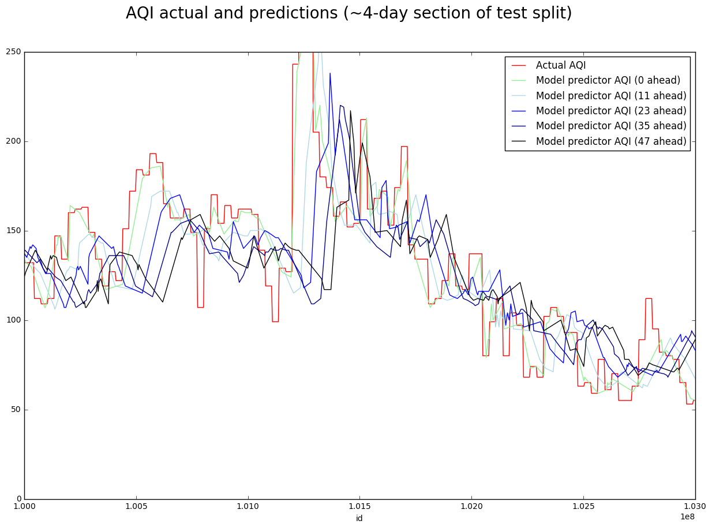
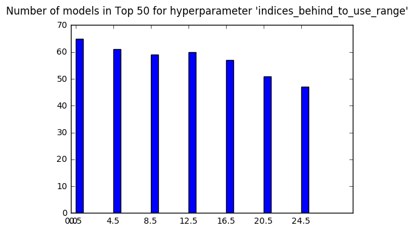
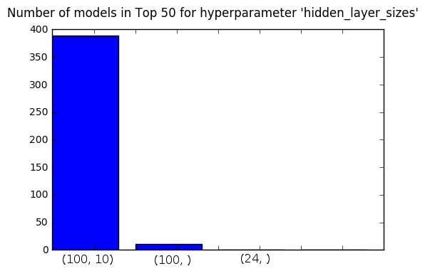
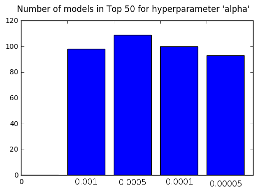
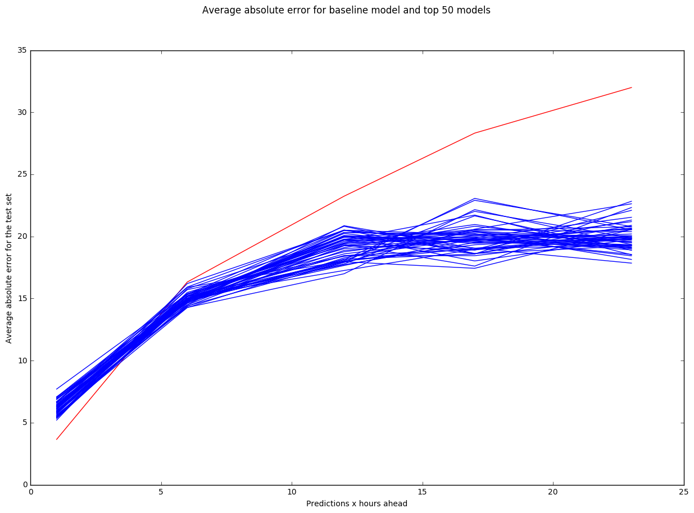

## Definition

### Project Overview x
Student provides a high-level overview of the project in layman’s terms. Background information such as the problem domain, the project origin, and related data sets or input data is given.

Air pollution was linked to 7 million premature deaths in 2012 [1] (~55 million people died in total in 2012 [2]). Using pollution masks when air pollution is bad can reduce premature deaths linked to air pollution. There are many consumer applications and services that broadcast what the air pollution is and has been, but there are very few that predict what air pollution will be. Similar to weather, individuals care more about air pollution in the near future, so they can make decisions about their day/week.

AQI (Air quality index) is a measurement that is commonly used to indicate air pollution. The number represents the greatest concentration (on a non-linear scale) of one of several types of harmful particles in the air. aqicn.org is a website that reports AQI in different locations around the world, and is used as a data source for this project.

### Problem Statement x
The problem which needs to be solved is clearly defined. A strategy for solving the problem, including discussion of the expected solution, has been made.

For a given location at a given point in time, what will the air pollution be for the next 24 hours?

For a given city at a given point in time, the model will use the inputs:

* The recent AQI of the location
* The recent AQI of other nearby locations
* The current date and time

Transformed to produce the normalized features:

* The cos and sine of the minute of the day (cos and sine used to make the input circular - where 0 is 'close' to 1)
* The cos and sine of the day of the week
* The cos and sine of the day of the month
* The cos and sine of the day of the year
* The recent AQI of the location
* The recent AQI of other nearby locations

Used to predict the following output:

* An AQI prediction for every hour over the next 24 hours

The model I expect to build will look like the following:


For predicting 2 hours ahead of the current time compared to 20 hours ahead of time, it makes sense to train different regressors, since the relevance of inputs are likely to be different. Taken to the extreme, the model uses a different regressor for each number of hours ahead to predict.

The total number of inputs available for each prediction is:

`48x + 8` where x is the number of nearby locations used

* 48 AQI measurements for a day in the past of a single location
* Multiple locations
* cos and sine of
  * minute of the day
  * day of the week
  * day of the month
  * day of the year

If there was one regressor for each n-hours-ahead-prediction, that regressor would have a very large number of inputs to train on. In order to mitigate that problem, predictions are broken into two steps. The first step is to have a regressor for each location, using the 48 inputs of that location to predict each n-hours-ahead output at the target location. The second step is to have a regressor for each n-hours-ahead-prediction using each n-hours-ahead prediction from the second step along with the date and time inputs to make a single n-hours-ahead prediction. 

### Metrics x
Metrics used to measure performance of a model or result are clearly defined. Metrics are justified based on the characteristics of the problem.

The model will minimize the total, across all n-hours-ahead-predictions, of the average absolute error for the n-hours-ahead-prediction.
Ex: 
If the average absolute error for the model's 1-hour-ahead-prediction is 1, the average absolute error for the model's 2-hours-ahead-prediction is 1, ..., and the average absolute error for the model's 24-hours-ahead-prediction is 1.
Then the total average absolute average error across all n-hours-ahead-predictions would be 24.

The model will not optimize for lower average absolute errors on n-hours-ahead-predictions that are sooner or later. Rather, all n-hours-ahead-predictions are given equal weights.
Ex: the average absolute error for the 2-hours-ahead-prediction will be weighted equally as the average absolute error for the 24-hours-ahead-prediction.

## Analysis

### Data Exploration x
If a dataset is present, features and calculated statistics relevant to the problem have been reported and discussed, along with a sampling of the data. In lieu of a dataset, a thorough description of the input space or input data has been made. Abnormalities or characteristics about the data or input that need to be addressed have been identified.


The data contains air pollution measurements for locations around the world between January 2016 - November 2016 at 30-minute intervals. The locations within the data are mostly located in Asia.

In the data there is:
 
* 3846 locations with air pollution measurements (there are ~2200 locations which consistently had measurements taken)
* 1428 locations have a null country name
* 1170 locations within 2200km of Xi'an (Xi'an is near the center of China, and 2200km from it covers most of China, Mongolia, some of North/South Korea, Japan, and the parts of South-East Asia closest to China
* 583 locations within 1500km of Nagpur, which covers India and it's immediately surrounding countries
* 80,861,270 air pollution measurements, 50,833,866 of which are valid (not null or 0)
* A typical location has 36,000 - 38,000 valid air pollution measurements

### Exploratory Visualization x
A visualization has been provided that summarizes or extracts a relevant characteristic or feature about the dataset or input data with thorough discussion. Visual cues are clearly defined.

This is a sample of the measurement data for a particular location over the course of four hours:

```
measurement_id date time AQI
2193809 2016-02-14 14:09:51.839324+00:00  132
2196001 2016-02-14 14:39:52.200313+00:00  132
2198160 2016-02-14 15:09:52.235176+00:00  151
2200351 2016-02-14 15:39:51.328592+00:00  151
2202541 2016-02-14 16:09:51.945945+00:00  152
2204737 2016-02-14 16:39:51.489899+00:00  152
2206920 2016-02-14 17:09:52.092272+00:00  144
2209138 2016-02-14 17:39:51.909793+00:00  132
2211305 2016-02-14 18:09:52.089035+00:00  132
```

This is an example of a single location's air pollution measurements over time. 

* The yellow dots are measurements
* The blue dots are simple linear regression, trained on the entire dataset, using the date+time as the only input
* The green dots are simple linear regression, trained on the first 80% of the dataset, using the date+time as the only input

For the whole year:


For November:


For four days in November:


There are two places in the year-long graph where there is obviously something wrong with the data. Here is a sample from that period:

```
measurement_id date time AQI
12188337 2016-05-02 03:28:36.971507+00:00   82
12193243 2016-05-02 03:29:06.895500+00:00   82
12193682 2016-05-02 03:29:09.333666+00:00   82
12198598 2016-05-02 03:29:38.043804+00:00   82
12198922 2016-05-02 03:29:39.627778+00:00   82
12203964 2016-05-02 03:30:06.296869+00:00   82
12204178 2016-05-02 03:30:07.322922+00:00   82
12209271 2016-05-02 03:30:33.996800+00:00   82
12209498 2016-05-02 03:30:35.108766+00:00   82
12214608 2016-05-02 03:31:04.258334+00:00   82
```

Measurements are being taken multiple times per-minute during that period. That portion of the data will be filtered out during preprocessing.

### Algorithms and Techniques xx
Algorithms and techniques used in the project are thoroughly discussed and properly justified based on the characteristics of the problem.

#### Circular Time Inputs

The data contains several distinct time features:

* Minute of the day
* Day of the week
* Day of the month
* Day of the year

These features are mutually exclusive. Intuitively, these features could each impact pollution differently. They are all circular - the largest value of each feature is 'beside' the smallest value. To provide the model with appropriate features, the following function is applied to a time value to generate two features that represent the single circular value:

```
def make_circular_input(input, input_max, input_min=0):
    # normalize the input to a real 0-1, then project it along
    # the first period of the sine/cosine waves
    normalized_projected = 2 * math.pi * (input - input_min) / (input_max - input_min)

    # apply sine / cosine and convert to a real number 0-1
    sine = (1 + math.sin(normalized_projected)) / 2
    cosine = (1 + math.cos(normalized_projected)) / 2
    return sine, cosine
```


#### Choice of Regressor

Convolutional neural networks might be a good choice for this problem because it has some time-series features (uses n-hours-in-the-past AQI features, for x ϵ 1..24). However, convolutional neural networks are difficult to tune and out of the scope of this project [xxx].

Multi-layer perceptron regressors were chosen because of their flexibility and because they are well-suited to approximating the extremely complex real-world events that cause a pollution measurement to change over time. Also, there is enough data that they will be useful (on the order of 30k rows of usable data per location). 

The choice of using several multi-layer perceptron regressors as well as layering them was made because:

* The n-hours-in-the-past AQI features are closely related for a given location, and seperate from those of another location
* If all possible n-hours-in-the-past features were used with a single regressor, there could be 240 (48 into the past x 5 location) n-hours-in-the-past AQI features

### Benchmark

The benchmark model used is one that predicts all future AQI measurements to be the current AQI measurement for a given location.

Ex: if the AQI measurement is 100 for a given location at a given point in time, the benchmark model will predict that in the location, each hour for the next 24 hours will have 100 AQI. 

## Methodology

### Data Preprocessing x
All preprocessing steps have been clearly documented. Abnormalities or characteristics about the data or input that needed to be addressed have been corrected. If no data preprocessing is necessary, it has been clearly justified.

1. Retrieve all measurements for a particular location, and several locations nearby to dataframes from the Postgres database. Measurements with invalid (null) AQI measurements were excluded.
2. Align the time series of measurements for different locations. This was complex (see `transform_data.py` line 172) and computationally expensive. The model needed different locations' AQI inputs to be at roughly the same time. A list of the time series that didn't have interruptions to the 30-minute cycle was logged for later (the continuous time series list). 

```
Ex: if one location had measurements take more often or measurements missing, the times would become unaligned.

Unaligned (loc_2_time skips a measurement):

loc_1_time loc_2_time
03:28:36   03:27:42
04:07:24   04:28:96 < fix this one
04:27:22   05:07:23


After alignment (other locations forced to skip the measurement):

loc_1_time loc_2_time
03:28:36   03:27:42
04:27:22   04:28:96
05:08:43   05:07:23
```

3. Combine the dataframes into one, containing rows: `loc_1_aqi, loc_1_datetime, loc_2_aqi, loc_2_datetime, ...`
4. Normalize aqi values
4. For each row and the single target location, generate `loc_1_n_ahead_aqi` ∀ n ϵ 1..24 (these are used as the data to test each prediction against).
5. For each row and each location, generate `loc_x_n_behind_aqi` ∀ n ϵ 0.5, 1, 1.5, ..., 24 (these are used as features).
6. Remove all the rows that are invalid - ∃ `loc_x_n_ahead_aqi` or `loc_x_n_behind_aqi` on the row that are either invalid or not all within a single continuous time series. If there are too many AQI measurements in succession with the same value, the row is considered invalid (it is extremely unusual to get the same AQI measurement three or four times in a row). 
7. For each row, convert the date and time into circular inputs for:

* Minute of the day
* Day of the week
* Day of the month
* Day of the year

### Implementation x
The process for which metrics, algorithms, and techniques were implemented with the given datasets or input data has been thoroughly documented. Complications that occurred during the coding process are discussed.

The expected solution described in the Problem Statement section contained many hypotheses. The process undertaken to evaluate whether the expected solution was appropriate was to individually evaluate each hypothesis while building up a pipeline and final model.

####  Hypothesis 1 x

Time of day, day of week, day of month, and day of year are fairly strong predictors of AQI.

[Notebook](./notebooks/hypothesis1_date_time.ipynb)

In exploring this hypothesis, some preprocessing steps were implemented: data retrieval and turning date and time inputs into circular features. 

A single location's AQI data was visualized and had a basic linear regressor applied to it, using just the circular features to predict AQI. See the following graph:

* The yellow dots are measurements
* The blue dots are simple linear regression, trained on the entire dataset, using the date+time as the only input
* The green dots are simple linear regression, trained on the first 80% of the dataset, using the date+time as the only input

For the whole year:


For November:


As expected, the regressor made cyclical predictions that had obvious periods of one day. There seemed a cycle with period of one year, and the monthly / weekly cycles were less obvious. Although far from a rigorous validation of the hypothesis, these visual results vaguely suggest at the validity of the hypothesis. It was more valuable to move on to further hypotheses than to dive into more rigour at this point.

#### Hypothesis 2 x

The recent AQI of a given location is a very good indicator of the near future AQI for that location.

[Notebook](./notebooks/hypothesis2_recent_history.ipynb)

In exploring this hypothesis, more preprocessing steps were implemented: normalizing AQI values, generating `loc_1_n_ahead_aqi` values, and generating `loc_x_m_behind_aqi` values. The baseline model was also implemented.

To explore this hypothesis, a MLP regressor was trained using the `loc_x_m_behind_aqi` features (and not the date and time features). The predictions appeared to be reasonable.
 
This graph shows a few days of the model's predictions. At any given location on the x-axis, the y-axis values are the model's predictions if it was predicting n hours ago. 



The predictions seem reasonable. Note that the predictions from further in the past are closer to the recent average than predictions from the near past. This is another positive indication that the predictor is making reasonable predictions.
 
Since the model seemed reasonable, it was more valuable to move onto further hypotheses. Again, this wasn't a rigorous validation of the hypothesis, especially because it wasn't comparing the model to the baseline model.

#### Hypothesis 3 x

When combining recent AQI and time regressors to make a prediction, the number of values needed for "recent AQI" is somewhere between 4 to 24 hours.

[Notebook](./notebooks/hypothesis3_history_depth.ipynb)

In exploring this hypothesis, another preprocessing step was implemented: removing invalid rows (due to null AQI measurements). 

To explore this hypothesis, much of the two-step model was implemented. The first step of the model was, for a single location, to use the `loc_1_m_behind_aqi` features with a MLP regressor to predict each `loc_1_n_ahead_aqi` output. The second step of the model was, for each `loc_1_n_ahead_aqi` prediction from the first step, to combine it with the date and time features to predict the corresponding `loc_1_n_ahead_aqi` output. This meant n + 1 regressors were trained and used (where n is the number of hours ahead to predict). The baseline model was also implemented.

These are the results for all the predictions on a single location. This kind of graph will used often. The x-axis represents predictions n hours in the future. The y-axis represents the average absolute error for the predictor. That means a single point is the average absolute error for the predictor predicting n hours ahead. Note that the baseline model error (red line) will always start low, quickly increase in error, then taper off. This is because in this graph, the baseline also represents the average difference between AQI measurements n hours apart.
  
In this particular graph, the greyscale lines represent the error for the different phases of the two-step model using different values of m for the features `loc_1_m_behind_aqi` (they use different amount of past input).


There is a significant difference between the performance of the first and second step of the model. There doesn't appear to be a big difference in the performance for using more past data, though.

This prediction was repeated for a number of other locations. This next graph was used to determine whether using more recent AQI data is useful to the model. This graph is different than the previous graph in that the x-axis represents models using m hours in the past (rather than the predictions n hours in the future). The lines worth paying attention to are the thicker ones - they represent the average across all the cities in this sample.


Most of the thick lines are flat. That means using the current AQI value is as useful for prediction as using the last 24 hours of AQI values (as features for the model). The blue line, which is the first-step predictions, becomes more accurate as more past AQI values are used. This is likely because the first step model is not using the date and time features to make a prediction. Also note that the one-step model (where date, time, and `loc_x_m_behind_aqi` features are inputted to a single regressor) does not perform well, validating the two-step process.
  
This graph seems to invalidate hypothesis 3, which is surprising. The surprising result is further explored during hyperparameter optimization (m of `loc_x_m_behind_aqi` is used as a hyperparameter to optimize). 

#### Hypothesis 4 x

The AQI of nearby locations is a very good indicator of the near future AQI for a given location.

[Notebook](./notebooks/hypothesis4_nearby_locations_building_model.ipynb)

In exploring this hypothesis, the rest of the preprocessing steps were implemented: merging dataframes from several locations' AQI measurements and aligning locations' AQI measurements. 

To explore this hypothesis, the rest of the two-step model was implemented. The first step of the model uses a MLP regressor for each location. The second step uses each location's prediction as well as the date and time features to make a prediction, whereas before, the second step used a single location's prediction. In total, x + n MLP regressors are trained and used, where x is the number of locations, and n is the number of hours ahead to make predictions. 

This graph compares using different numbers of locations to make predictions on a single location's future AQI (one vs. three). The blue lines are the first step predictions using three different nearby locations recent AQI.


There is no obvious difference between using one vs. three locations. This seems to invalidate the hypothesis. Again, the surprising result is further explored during hyperparameter optimization (the number of nearby locations is used as a hyperparameter to optimize).

### Refinement x
The process of improving upon the algorithms and techniques used is clearly documented. Both the initial and final solutions are reported, along with intermediate solutions, if necessary.

[This is the notebook](./notebooks/hyperparameter_optimization.ipynb) for doing the hyperparameter optimization grid search. 

[This is the notebook](./notebooks/hyperparameter_optimization_graphs.ipynb)  for the visualization of the results of some hyperparameter optimization.

The hyperparameters optimized were:

* MLP regressor alpha values: `[0.001, 0.0005, 0.0001, 5e-05]`
* MLP regressor hidden layer sizes: `[(24,), (100,), (100, 10)]`
* `m` hrs ranges in `loc_x_m_behind_aqi`: `[range(0, 1, 1), range(0, 4, 2), range(0, 8, 2), range(0, 12, 2), range(0, 33, 2), range(0, 41, 2), range(0, 49, 2)]`
* Number of nearby locations to use: `[1, 2, 3, 4, 5]`

To reduce the running time of testing hyperparameters on a single location, the following hours ahead were predicted for each model: `[1, 6.5, 12, 17.5, 23]`. Testing the 420 combinations of hyperparameters for a single location took approximately 40 minutes on my computer. Hyperparameter optimization was performed on eight locations, and the results were conclusive enough to not warrant more runs. 

## Results

### Model Evaluation and Validation x
The final model’s qualities — such as parameters — are evaluated in detail. Some type of analysis is used to validate the robustness of the model’s solution.

If one set of optimal hyperparameters were to be chosen, they would be as follows:

* MLP regressor alpha: 0.0005 was optimal
* MLP regressor hidden layer size: (100, 10)
* Hours into the recent past to use: 12.5 (`range(0, 33, 2)`)
* Number of nearby locations to use: 5

Each location had a different set for the hyperparameter combination with the lowest average absolute error. When analyzing the top 10 and top 50 hyperparameter combinations, the set above emerged as a highly performant one.

A large caveat to those results is that this model is not used for the first five hours of prediction. The baseline model consistently beat all models in the hyperparameter optimization ste in the first five hours, and when comparing models that performed well in predicting the first five hours against models that performed well overall, their hyperparameters differed significantly. Given those results, an intermediate solution is to use the baseline model for the first five hours ahead of prediction. 










### Justification x
The final results are compared to the benchmark result or threshold with some type of statistical analysis. Justification is made as to whether the final model and solution is significant enough to have adequately solved the problem.

This graph shows the performance of the top 50 models by total absolute average error for a single location. Graphs for other locations look similar.



The top 50 models are much more performant than the baseline model, with the exception of the first five hours of prediction where the baseline outperforms the other models by two to five AQI units. The difference in performance between those 50 models would be inconsequential to an end user viewing pollution predictions because the average difference in performance for a given measurement is approximately two or three AQI units.  

## Conclusion

### Free-form Visualization xx
A visualization has been provided that emphasizes an important quality about the project with thorough discussion. Visual cues are clearly defined.

The final model structure was very performant, but it didn't work exceptionally well for predictions in the first five hours or so. These next few graphs explore the differences in hyperparameters between models that best predicted four hours ahead vs. twenty four hours ahead: 

These two graphs compare the number of hours behind of input used to make predictions. The first graph is the top performing models at predicting four hours ahead. The second graph is the top performing models at predicting twenty four hours ahaed.


All the highest performing models predicting four hours ahead used just the current AQI value, while there was more distributed performance for predicting twenty four hours ahead. This stark difference indicates that the structure of the final model is unsuitable for predicting the first five or so hours ahead. This is because the first graph suggests that trends in the recent past, when combined with time inputs, have no predictive power for the immediate future, but have predictive power just beyond the immediate future. This is not an intuitive conclusion.

These two graphs compare the hidden layer sizes on the MLP regressors used to make predictions (in a fashion similar to the previous graphs).


<talk about how it means we have to have different regressors for both>

<talk about how number of locations and MLP alpha values these ones are definite/consistent>

### Reflection x
Student adequately summarizes the end-to-end problem solution and discusses one or two particular aspects of the project they found interesting or difficult.

The way the problem was ultimately solved was:

1. I thought deeply about how to model the predictor, until I decided on a model structure.
2. I expressed the hypotheses I had, which caused me to choose this model structure. If any of the hypotheses were proven invalid, I would have changed the structure of the model.
3. I explored the data and validated hypotheses while slowly building up the structure of the model.
4. I performed some hyperparameter optimization.
5. I analysed the results to choose a "best solution".

Getting all the data on one dataframe row necessary to train the model required about a third of the effort required to complete the project. Much of this time was spent exploring the intracacies of Pandas, but it was also an algorithmically complex problem to align and move so much data between rows.

Arriving at the model with two-steps of neural networks was interesting. Given the input data, it was worthwhile to imagine the different ways to structure a predictive model. Having a set of hypotheses that needed to be proven to validate the structure of the model was the foundation set early on in the project. Attempting to validate each hypothesis while building the model was a valuable and productive exercise.   

### Improvement x
Discussion is made as to how one aspect of the implementation could be improved. Potential solutions resulting from these improvements are considered and compared/contrasted to the current solution.

The problem was a difficult one to solve for the scope of this project. There are a host of obvious improvements that could be made:

* Use a different regressor for the second step (different type or with different hyperparameters) 
* When there is invalid data, approximate it instead of throwing it out (because it causes several rows in either direction to be invalid, since neural networks require all inputs to be non-null)
* Try with at least twelve months of data
* Try with at least two years of data

A more interesting improvement that would make the model more relevant in a production environment would be to test the model in a way where it is progressively tested with more and more data rather than once with all the data. The way this model would be used in reality is that every few hours or days, it would be retrained for each location with the newly collected data since it was last trained. This is much different than the conditions under which the final model was produced. In order to make the model perform better in its actual use case, it should be tested by gradually adding more data to the training set over time, generating several test/training splits with which to optimize the model.


## References xx

Xavier Glorot and Yoshua Bengio. Understanding the difficulty of training deep feedforward neural networks. Proceedings of the 13th International Conference on Artificial Intelligence and Statistics, 9:249– 256, 2010


## Testing Hypotheses


### Tune the predictor

 * Try on different cities
 * Do the multi-step testing (train on 1st month, predict second; train on 1-2mo test on 3rd; train on 1-3mo test on 4th, etc.)
 * Find how far to look into the past for nearby cities
 * Different regressor for time predictor
 * Recurrent neural networks instead of normal for recent AQI
 * 
 * Clean the data better? (use actual 30 min intervals)

## Notes

### Problem Statement

 * Dataset is actually ~5gB, not 16gB
 * Lots of the data is just null values
 * Benchmark model is actually predicting the same AQI for the next 24 hours
 * The data isn't in perfect 30min intervals

### Solution Statement

For a given city at a given point in time, the model will use the inputs:

* The recent AQI history of the location (on the order of 1 to 10 days)

* The location’s latitude and longitude

* The recent AQI history of other locations (and their latitudes/longitudes)

* The current date and time

* The long-term AQI history of the location (possibly)

To produce the output:

* An AQI prediction for every hour over the next 24 hours for this location (required)

* An AQI prediction for every hour over the next week (less important, nice-to-have)

To train, the model will perform the following preprocessing:

* Scale the AQI numbers from 0 to 1 - this will require exploring the larger AQI number in the dataset to find an upper-bound number that enables high accuracy without excluding high-AQI predictions

* Convert the latitudes and longitudes of nearby cities into the distance from the target city’s latitude and longitude, so the distance can be used as a way to scale the importance of each location’s recent AQI history. The distances will be scaled to be within 0-1, where 1 is the largest distance between "nearby cities" used in the model

* Change the current date and time into:

    * The current hour of day

    * The current day of week

    * The current day of month

    * The current day of year

* For all AQI numbers that are invalid (described in Dataset and Inputs), treat them as if their value is the last valid AQI number for the city, but don’t learn or train on them (they should not be used as a target AQI to guess)

Then the model will split the data into a test/training set (see Evaluation Metrics). Finally, the model will train on the training set:

1. Train recurrent neural networks for each location.

2. Train neural network combining nearby locations’ prediction data with current date and time for each location.
