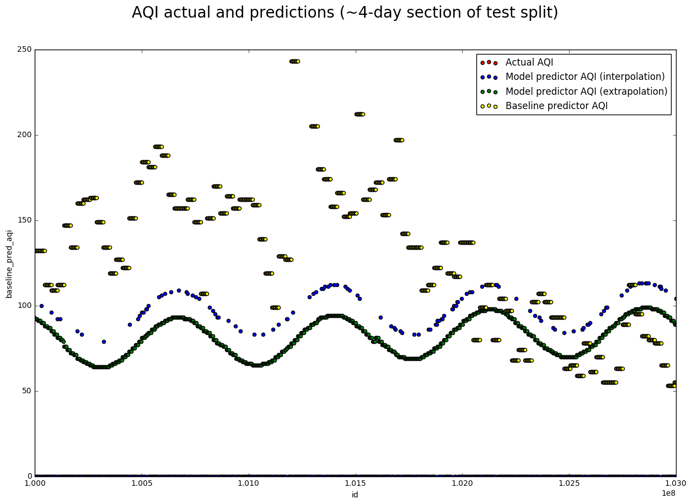
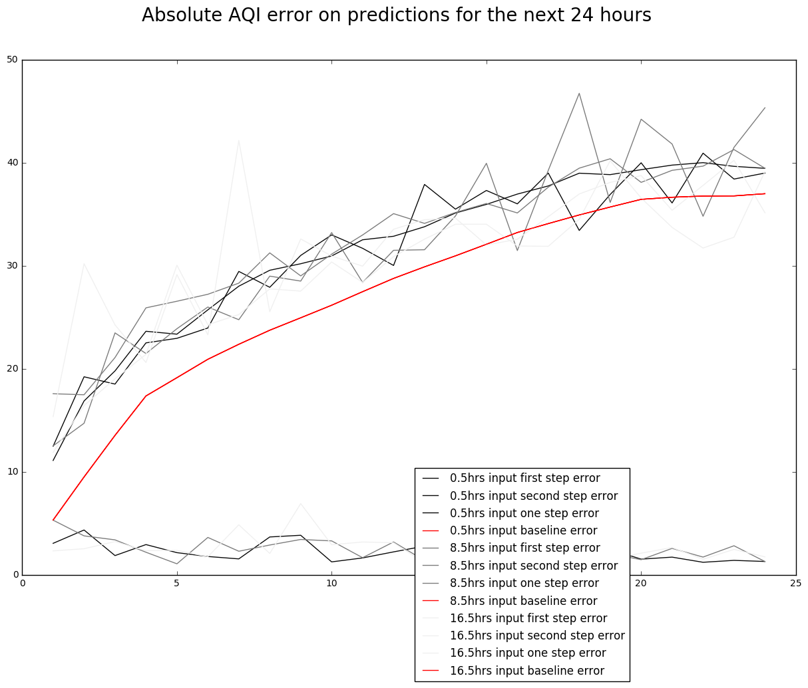
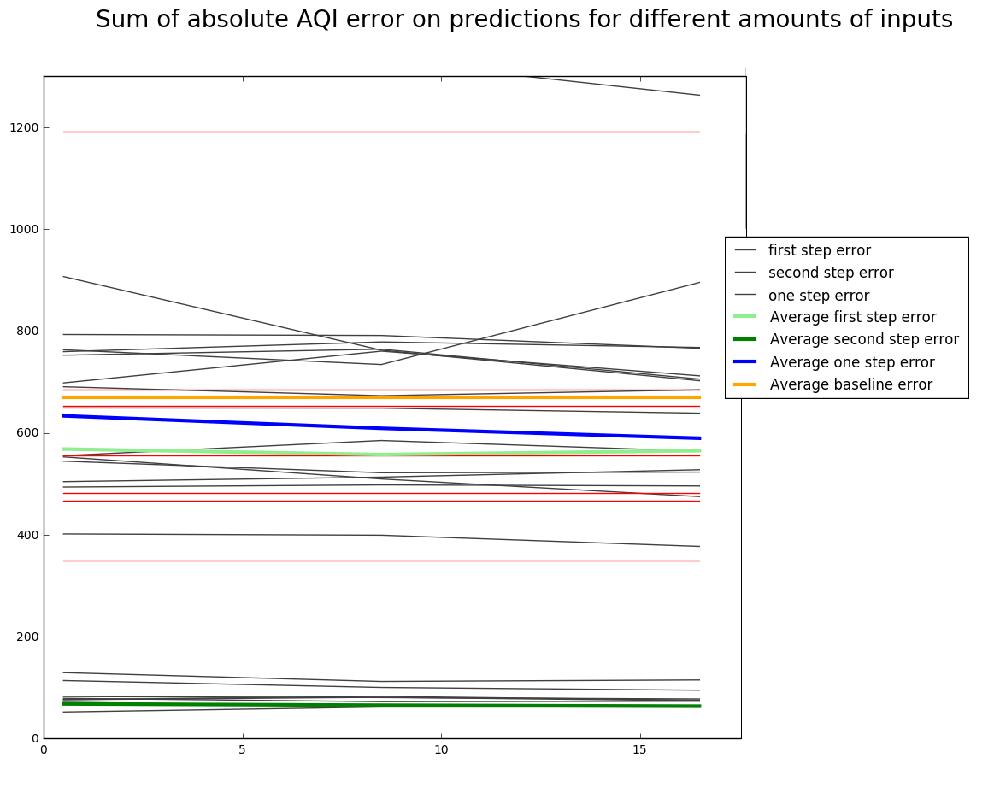
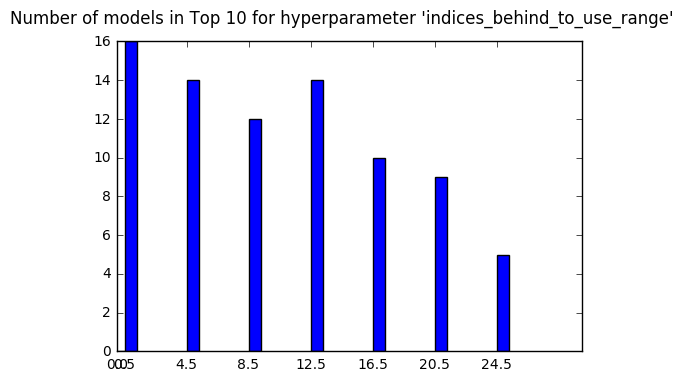
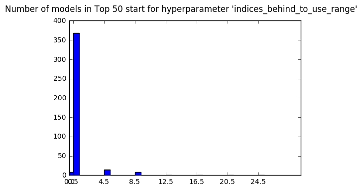
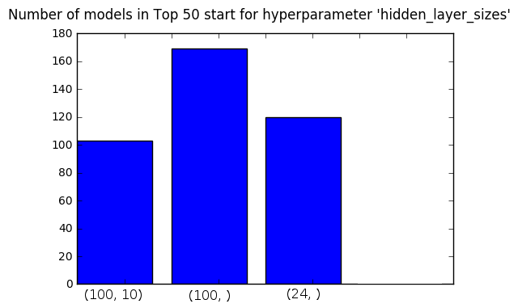

## Definition

### Project Overview

Air pollution was linked to 7 million premature deaths in 2012 [[1]](References) (~55 million people died in total in 2012 [[2]](References)). Using pollution masks when air pollution is bad can reduce premature deaths linked to air pollution. There are many consumer applications and services that broadcast what the air pollution is and has been, but there are very few that predict what air pollution will be. Similar to weather, individuals care more about air pollution in the near future, so they can make decisions about their day/week.

AQI (Air quality index) is a measurement that is commonly used to indicate air pollution. The number represents the greatest concentration (on a non-linear scale) of one of several types of harmful particles in the air. aqicn.org is a website that reports AQI in different locations around the world, and is used as a data source for this project.

Air pollution predictions, like weather predictions, are useful to consumers to plan the near future. Someone living in a variably polluted city will make decisions in everyday life depending on the current and future air pollution levels.

In literature, air pollution prediction models, similar to weather prediction, often use meteorological data such as temperature, humidity, rainfall, wind direction, wind speed, and precipitation [[3]](References). Air pollution prediction models using meteorological data can use support vector machines and artificial neural networks [[3]](References) [[4]](References). In this project, I will be using previous pollution measurements and no meteorological data to build a predictive model.   

Note for reviewer: [Proposal review](https://review.udacity.com/#!/reviews/267521)

### Problem Statement

For a given location at a given point in time, what will the air pollution be for the next 24 hours?

For a given city at a given point in time, the model will use the inputs:

* The recent AQI of the location
* The recent AQI of other nearby locations
* The current date and time

Transformed to produce the normalized features:

* The cos and sine of the minute of the day (cos and sine used to make the input circular - where 0 is 'close' to 1)
* The cos and sine of the day of the week
* The cos and sine of the day of the month
* The cos and sine of the day of the year
* The recent AQI of the location
* The recent AQI of other nearby locations

Used to predict the following output:

* An AQI prediction for every hour over the next 24 hours

The machine learning model structure for a solution to this problem is as follows:


For predicting 2 hours ahead of the current time compared to 20 hours ahead of time, it makes sense to train different regressors, since the relevance of inputs are likely to be different. Taken to the extreme, the model uses a different regressor for each number of hours ahead to predict.

The total number of inputs available for each prediction is:

`48x + 8` where x is the number of nearby locations used

* 48 AQI measurements for a day in the past of a single location
* Multiple locations (x)
* sine and cosine of
  * Minute of the day
  * Day of the week
  * Day of the month
  * Day of the year

If there was one regressor for each n-hours-ahead-prediction, that regressor would have a very large number of inputs to train on. In order to mitigate that problem, predictions are broken into two steps. The first step is to have a regressor for each location, using the 48 inputs of that location to predict each n-hours-ahead output at the target location. The second step is to have a regressor for each n-hours-ahead-prediction using each n-hours-ahead prediction from the second step along with the date and time inputs to make a single n-hours-ahead prediction.
 
Contained within this model are several hypotheses that must be validated:

* Time of day, day of week, day of month, and day of year are fairly strong predictors of AQI.
* The recent AQI of a given location is a very good indicator of the near future AQI for that location.
* When combining recent AQI and time regressors to make a prediction, the number of values needed for "recent AQI" is somewhere between 4 to 24 hours.
* The AQI values of nearby locations are very good indicators of the near future AQI for a given location.

### Metrics

The model will minimize the total, across all n-hours-ahead-predictions, of the average absolute error for the n-hours-ahead-prediction.

Ex: If the average absolute error for the model's 1-hour-ahead-prediction is `1`, the average absolute error for the model's 2-hours-ahead-prediction is `1`, ..., and the average absolute error for the model's 24-hours-ahead-prediction is `1`.
Then the total average absolute average error across all n-hours-ahead-predictions would be `24`.

The model will not optimize for lower average absolute errors on n-hours-ahead-predictions that are sooner or later. Rather, all n-hours-ahead-predictions are given equal weights.

Ex: the average absolute error for the 2-hours-ahead-prediction will be given the same weight as the average absolute error for the 24-hours-ahead-prediction.

## Analysis

### Data Exploration

The data contains air pollution measurements for locations around the world between January 2016 - November 2016 at 30-minute intervals. The locations within the data are mostly located in Asia.

In the data there are:
 
* 3846 locations with air pollution measurements (there are ~2200 locations which consistently had measurements taken)
* 1170 locations within 2200km of Xi'an
  * Xi'an is near the center of China, and 2200km from it covers most of China, Mongolia, some of North/South Korea, Japan, and the parts of South-East Asia closest to China
* 583 locations within 1500km of Nagpur, India 
  * Nagpur is near the center of India, and 1500km from it covers India and part of its immediately surrounding countries
* 80,861,270 air pollution measurements, 50,833,866 of which are valid (not null or 0)
* A typical location has 36,000 - 38,000 valid air pollution measurements

### Exploratory Visualization

This is a sample of the measurement data for a particular location over the course of four hours:

```
measurement_id date time AQI
2193809 2016-02-14 14:09:51.839324+00:00  132
2196001 2016-02-14 14:39:52.200313+00:00  132
2198160 2016-02-14 15:09:52.235176+00:00  151
2200351 2016-02-14 15:39:51.328592+00:00  151
2202541 2016-02-14 16:09:51.945945+00:00  152
2204737 2016-02-14 16:39:51.489899+00:00  152
2206920 2016-02-14 17:09:52.092272+00:00  144
2209138 2016-02-14 17:39:51.909793+00:00  132
2211305 2016-02-14 18:09:52.089035+00:00  132
```

This is an example of a single location's air pollution measurements over time. 

* The yellow dots are measurements
* The blue dots are simple linear regression, trained on the entire dataset, using the date+time as the only input
* The green dots are simple linear regression, trained on the first 80% of the dataset, using the date+time as the only input

For the whole year:


For November:


For four days in November:



There are two places in the year-long graph where there is obviously something wrong with the data. Here is a sample from that period:

```
measurement_id date time AQI
12188337 2016-05-02 03:28:36.971507+00:00   82
12193243 2016-05-02 03:29:06.895500+00:00   82
12193682 2016-05-02 03:29:09.333666+00:00   82
12198598 2016-05-02 03:29:38.043804+00:00   82
12198922 2016-05-02 03:29:39.627778+00:00   82
12203964 2016-05-02 03:30:06.296869+00:00   82
12204178 2016-05-02 03:30:07.322922+00:00   82
12209271 2016-05-02 03:30:33.996800+00:00   82
12209498 2016-05-02 03:30:35.108766+00:00   82
12214608 2016-05-02 03:31:04.258334+00:00   82
```

Measurements are being taken multiple times per minute during that period. That portion of the data will be filtered out during preprocessing.

### Algorithms and Techniques

#### Circular Time Inputs

The data contains several distinct time features:

* Minute of the day
* Day of the week
* Day of the month
* Day of the year

These features are mutually exclusive. Intuitively, these features could each impact pollution differently. They are all circular - the largest value of each feature is 'beside' the smallest value. To provide the model with appropriate features, the following function is applied to a time value to generate two features that represent the single circular value:

```
def make_circular_input(input, input_max, input_min=0):
    # normalize the input to a real 0-1, then project it along
    # the first period of the sine/cosine waves
    normalized_projected = 2 * math.pi * (input - input_min) / (input_max - input_min)

    # apply sine / cosine and convert to a real number 0-1
    sine = (1 + math.sin(normalized_projected)) / 2
    cosine = (1 + math.cos(normalized_projected)) / 2
    return sine, cosine
```

#### Choice of Regressor

Multi-layer perceptron regressors were chosen because of their flexibility and because they are well-suited to approximating the extremely complex real-world events that cause a pollution measurement to change over time. Also, there is enough data that they will be useful (on the order of 30k rows of usable data per location). 

The choice of using several multi-layer perceptron regressors as well as layering them was made because:

* The n-hours-in-the-past AQI features are closely related for a given location, and seperate from those of another location
* If all possible n-hours-in-the-past features were used with a single regressor, there could be 240 (48 into the past x 5 location) n-hours-in-the-past AQI features. Using a single regressor with all inputs was tried and it was much less performant [see hypothesis 3](./report.md#hypothesis-3).

#### Model Structure

The first layer of the model uses a supervised multi-layer perceptron (MLP) algorithm for each location. The algorithm uses the n integer AQI inputs into the past, and for each neuron in the hidden layers, transforms the values from the previous layer to generate a value. The transformation function is learned by each neuron by back-propogating the error on each training sample output of the 24 hours of output. The structure of the hidden layers is an input to the algorithm, as well as some parameters about how quickly and under what initial conditions the neurons learn. It's important to note that the neural network isn't implicitly structured to handle time-series data - the algorithm would treat inputs `one hour ago AQI` the same as `current millisecond of second`, but learns the utility of each input, and is able to learn that trends along the time series `n hours ago AQI` impact outputs, but it's not guaranteed to learn or part of the explicit structure of the algoritm. Other types of predictive models structurally support time series data, but are out of scope of this project (recurrant neural networks).

The second layer of the model also uses a supervised MLP algorithm. Other algorithms could have been used for this layer, but MLP is flexible enough and chosen for convenience (since the first layer was also using one). One MLP regressor was used for every hour ahead to be predicted (predicting one `m hours ahead` value) because the behaviour of a model that predicts one hour ahead is likely much different than one that predict 24 hours ahead. The inputs for a single MLP regressor on this layer are the circular time inputs as well as each nearby location's first layer prediction for this `m hours ahead` corresponding to this `m hours ahead` MLP regresor.

### Benchmark

The benchmark model used is one that predicts all future AQI measurements to be the current AQI measurement for a given location.

Ex: if the AQI measurement is 100 for a given location at a given point in time, the benchmark model will predict that in the location, each hour for the next 24 hours will have 100 AQI. 

## Methodology

### Data Preprocessing

These are the steps taken to make a single pandas dataframe that the predictive model can be trained and tested against:

* Retrieve all measurements for a particular location, and several locations nearby, to dataframes from the Postgres database. Measurements with invalid (null) AQI measurements are excluded.
* Align the time series of measurements for different locations. This was complex (see `predict_aqi/transform_data.py` line 172) and computationally expensive. The model needed different locations' AQI inputs to be at roughly the same time. A list of each time series (a list of dataframe index ranges) that didn't have interruptions to the "one measurement every 30 minutes" cycle was logged for later (the continuous time series list). 

```
Ex: if one location had measurements take more often or measurements missing, the times would become unaligned.

Unaligned (loc_2_time skips a measurement):

loc_1_time loc_2_time
03:28:36   03:27:42
04:07:24   04:28:96 < fix this one
04:27:22   05:07:23


After alignment (other locations forced to skip the measurement):

loc_1_time loc_2_time
03:28:36   03:27:42
04:27:22   04:28:96
05:08:43   05:07:23
```

* Combine the dataframes into one, containing rows: `loc_1_aqi, loc_1_datetime, loc_2_aqi, loc_2_datetime, ...`
* Normalize aqi values (from integers between 0-300 to real numbers between 0-1, values greater than 300 were treated as 300)
* For each row and the single target location, generate `loc_1_n_ahead_aqi` ∀ n ϵ 1..24 (these are used as the data to test each prediction against).
* For each row and each location, generate `loc_x_n_behind_aqi` ∀ n ϵ 0.5, 1, 1.5, ..., 24 (these are used as features).
* Remove all the rows that are invalid: a row is invalid if ∃ `loc_x_n_ahead_aqi` or `loc_x_n_behind_aqi` on the row that are either invalid or not all within a single continuous time series. If there are too many AQI measurements in succession with the same value, the row is also considered invalid (it is extremely unusual to get the same AQI measurement three or four times in a row). 
* For each row, convert the date and time into circular inputs for:
    * Minute of the day
    * Day of the week
    * Day of the month
    * Day of the year

### Implementation

The expected solution described in the Problem Statement section contained many hypotheses. The process undertaken to evaluate whether the expected solution was appropriate was to individually evaluate each hypothesis while building up the pipeline and final model.

####  Hypothesis 1

*Time of day, day of week, day of month, and day of year are fairly strong predictors of AQI.*

[Notebook](./predict_aqi/notebooks/hypothesis1_date_time.ipynb)

In exploring this hypothesis, some preprocessing steps were implemented: data retrieval and turning date and time inputs into circular features. 

A single location's AQI data was visualized and had a basic linear regressor applied to it, using just the circular features to predict AQI. See the following graph:

* The yellow dots are measurements
* The blue dots are simple linear regression, trained on the entire dataset, using the date+time as the only input
* The green dots are simple linear regression, trained on the first 80% of the dataset, using the date+time as the only input

For the whole year:


For November:


As expected, the regressor made cyclical predictions that had obvious periods of one day. There also seemed to be a cycle with period of one year, and the monthly / weekly cycles were less obvious. Although far from a rigorous validation of the hypothesis, these visual results vaguely suggest at the validity of the hypothesis. It was more valuable to move on to further hypotheses than to dive into more rigour at this point.

Complications faced at this step were:

* Initially visualizing the data with matplotlib and its pandas integration - the difference between the figure, axis, and plot objects, and how they interact in a jupyter notebook with the pandas integration is non-trivial.
* Difficulty visualizing model error in a meaningful way (foreshadowing future hardship)

#### Hypothesis 2

*The recent AQI of a given location is a very good indicator of the near future AQI for that location.*

[Notebook](./predict_aqi/notebooks/hypothesis2_recent_history.ipynb)

In exploring this hypothesis, more preprocessing steps were implemented: normalizing AQI values, generating `loc_1_n_ahead_aqi` values, and generating `loc_x_m_behind_aqi` values. The baseline model was also implemented.

To explore this hypothesis, a MLP regressor was trained using the `loc_x_m_behind_aqi` features (and not the date and time features). The predictions appeared to be reasonable.
 
This graph shows a few days of the model's predictions. At any given location on the x-axis, the y-axis values are the model's predictions if it was predicting n hours ago. 


The predictions seem reasonable. Note that the predictions from further in the past are closer to the recent average than predictions from the near past. This is another positive indication that the predictor is making reasonable predictions.
 
Since the model seemed reasonable, it was more valuable to move onto further hypotheses. Again, this wasn't a rigorous validation of the hypothesis, especially because it wasn't comparing the model to the baseline model.

Complications faced at this step were:

* Visualizing predictions - for any one point in time (on the time (x) axis), a single model makes 24 predictions for future time values. It's difficult to visualize the predictions for a single model on one graph and very difficult to compare predictions of different models.
* Preprocessing data to get `n hours in the past AQI` and `m hours in the future AQI` on one single dataframe row for every row - pandas isn't really designed to perform inter-row operations, understandably.

#### Hypothesis 3

*When combining recent AQI and time regressors to make a prediction, the number of values needed for "recent AQI" is somewhere between 4 to 24 hours.*

[Notebook](./predict_aqi/notebooks/hypothesis3_history_depth.ipynb)

In exploring this hypothesis, another preprocessing step was implemented: removing invalid rows (due to null AQI measurements). 

To explore this hypothesis, much of the two-step model was implemented. The first step of the model was, for a single location, to use the `loc_1_m_behind_aqi` features with a MLP regressor to predict each `loc_1_n_ahead_aqi` output. The second step of the model was, for each `loc_1_n_ahead_aqi` prediction from the first step, to combine it with the date and time features to predict the corresponding `loc_1_n_ahead_aqi` output. This meant n + 1 regressors were trained and used (where n is the number of hours ahead to predict).

These are the results for all the predictions on a single location. The x-axis represents predictions n hours in the future. The y-axis represents the average absolute error for the predictor. That means a single point is the average absolute error for a given predictor predicting n hours ahead for a given location. Note that the baseline model error (red line) will always start low, quickly increase in error, then taper off. This is because in this kind of graph, the error of the baseline model also happens to be the average difference between AQI measurements n hours apart (where n is the x-axis value).

In this particular graph, the greyscale lines represent the error for the different phases of the two-step model using different values of m for the features `loc_1_m_behind_aqi` (they use different amount of past input).



There is a significant difference between the performance of the first and second step of the model. One step models (where all features were fed into a single regressor) were also tested, and they performed worse than the first step of the two-step model. There doesn't appear to be a big difference in the performance for using more past data.

This prediction was repeated for a number of other locations. This next graph was used to determine whether using more recent AQI data is useful to the model. This graph is different than the previous graph in that the x-axis represents models using m hours in the past (rather than the predictions n hours in the future). The lines worth paying attention to are the thicker ones - they represent the average across all the cities in this sample.



Most of the thick lines are flat. That means using the current AQI value is as useful for prediction as using the last 24 hours of AQI values (as features for the model). The blue line, which is the first-step predictions, becomes more accurate as more past AQI values are used. This is likely because the first step model is not using the date and time features to make a prediction. Also note that the one-step model (where date, time, and `loc_x_m_behind_aqi` features are inputted to a single regressor) does not perform well, validating the two-step process.
  
This graph seems to invalidate hypothesis 3, which is surprising. The surprising result is further explored during hyperparameter optimization (m of `loc_x_m_behind_aqi` is used as a hyperparameter to optimize).

Complications faced at this step were:

* The hypothesis appeared incorrect - the temporary solution was not to believe the results, and wait for more comprehensive results from hyperparameter optimization.
* Building the two-step model - the architecture necessary to make one the results of one regressor to be inputs to another, as well as training several regressors with different input and output parameters is non-trivial. 
* Filtering out invalid data without causing invalid inputs to the model - since the input data is a time series, a single invalid AQI value causes several rows before and after to be invalid, since values ahead are used to train against, and values behind are used as inputs.
* Visualizing error - like visualizing predictions, visualizing errors was difficult because a single predictive model could have different error for each of its 24 predictions in the future. It was important to differentiate and visualize each of those prediction errors.

#### Hypothesis 4

*The AQI values of nearby locations are very good indicators of the near future AQI for a given location.*

[Notebook](./predict_aqi/notebooks/hypothesis4_nearby_locations_building_model.ipynb)

In exploring this hypothesis, the rest of the preprocessing steps were implemented: merging dataframes from several locations' AQI measurements and aligning locations' AQI measurements. 

To explore this hypothesis, the rest of the two-step model was implemented. The first step of the model uses a MLP regressor for each location. The second step uses each location's prediction as well as the date and time features to make a prediction, whereas before, the second step used a single location's prediction. In total, `x + n` MLP regressors are trained and used, where `x` is the number of locations, and `n` is the number of hours ahead to make predictions. 

This graph compares using different numbers of locations to make predictions on a single location's future AQI (one vs. three). The blue lines are the first step predictions using three different nearby locations recent AQI.


There is no obvious difference between using one vs. three locations. This seems to invalidate the hypothesis. Again, the surprising result is further explored during hyperparameter optimization (the number of nearby locations is used as a hyperparameter to optimize).

Complications faced at this step were:

* Aligning the time series data for multiple locations - this was an algorithmically and computationally intense problem, especially with the additional confounding issue of invalid data. The solution chosen was far from optimal, but the first working one.
* The hypothesis appeared incorrect - the temporary solution was not to believe the results, and wait for more comprehensive results from hyperparameter optimization.

### Refinement

[This is the notebook](./predict_aqi/notebooks/hyperparameter_optimization.ipynb) for doing the hyperparameter optimization grid search. 

[This is the notebook](./predict_aqi/notebooks/hyperparameter_optimization_graphs.ipynb)  for the visualization of the results of some hyperparameter optimization.

The hyperparameters optimized were:

* MLP regressor alpha values: `[0.001, 0.0005, 0.0001, 5e-05]`
* MLP regressor hidden layer sizes: `[(24,), (100,), (100, 10)]`
* `m` hrs ranges in `loc_x_m_behind_aqi`: `[range(0, 1, 1), range(0, 4, 2), range(0, 8, 2), range(0, 12, 2), range(0, 33, 2), range(0, 41, 2), range(0, 49, 2)]`
* Number of nearby locations to use: `[1, 2, 3, 4, 5]`

In total, 420 two-step models were evaluated for each location the hyperparameter optimization was performed on. To reduce the running time of testing hyperparameters on a single location, the following hours ahead were predicted for each model: `[1, 6.5, 12, 17.5, 23]`. Testing the 420 combinations of hyperparameters for a single location took approximately 40 minutes on my computer. Hyperparameter optimization was performed on eight locations, and the results were conclusive enough to not warrant more runs. 

## Results

### Model Evaluation and Validation

If one set of optimal hyperparameters were to be chosen, they would be as follows:

* MLP regressor alpha: `0.0005` was optimal
* MLP regressor hidden layer size: `(100, 10)`
* Hours into the recent past to use: `12.5` (`range(0, 33, 2)`)
* Number of nearby locations to use: `5`

Each location had a different set for the hyperparameter combination with the lowest average absolute error. When analyzing the top 10 and top 50 hyperparameter combinations, the set above emerged as a highly performant one.

A large caveat to those results is that this model is not used for the first five hours of prediction. For in the first five hours of prediction, the baseline model consistently beat all models produced in hyperparameter optimization, and when comparing models that performed well in predicting the first five hours against models that performed well overall, their hyperparameters differed significantly. Given those results, an intermediate solution is to use the baseline model for the first five hours ahead of prediction. 

The following graphs compare the performance of models for different hyperparameters. Of the 420 models trained for a single location, the top 10 or 50 were selected for each location and the hyperparameters of those models were compared.

Hours into the recent past to use:




Unlike during exploring hypothesis 3, it appears that models perform better using quite a few hours into the past.

Number of nearby locations to use:


Unlike during exploring hypothesis 4, it appears that models perform better using more nearby locations.

MLP regressor hidden layer size:


MLP regressor alpha:


### Justification

This graph shows the performance of the top 50 models by total absolute average error for a single location. Graphs for other locations look similar.


The top 50 models are much more performant than the baseline model, with the exception of the first five hours of prediction where the baseline outperforms the other models by two to five AQI units. The difference in performance between those 50 models would be inconsequential to an end user viewing pollution predictions because the average difference in performance for a given measurement is approximately two or three AQI units (for comparison, for an end user, two or three AQI units is like 0.2 or 0.3 degrees Celsius when one is looking at temperature).  

## Conclusion

### Free-form Visualization

The final model structure was very performant, but it didn't work exceptionally well for predictions in the first five hours or so. These next few graphs explore the differences in hyperparameters between models that best predicted four hours ahead vs. twenty four hours ahead: 

These two graphs compare the number of hours behind of input used to make predictions. The first graph is the top performing models at predicting four hours ahead. The second graph is the top performing models at predicting twenty four hours ahaed.




All the highest performing models predicting four hours ahead used just the current AQI value, while there was more distributed hyperparameter values for predicting twenty four hours ahead. This stark difference indicates that the structure of the final model is unsuitable for predicting the first five or so hours ahead. This is because these two graphs suggests that trends in the recent past, when combined with time inputs, have no predictive power for the immediate future, but have predictive power just beyond the immediate future. This is not an intuitive conclusion.

These two graphs compare the hidden layer sizes on the MLP regressors used to make predictions (in a fashion similar to the previous graphs).




The highest performing models predicting four hours ahead perform better with a MLP hidden layer size value of `(100,)` instead of `(100, 10)`. They also perform well with hidden layer sizes of `(100, 10)` and `(24,)`. This makes sense, since the models that perform better at predicting four hours ahead also have much fewer inputs, and fewer inputs necessitate smaller neural networks.

The MLP regressor alpha value and number of nearby locations were both consistent for both types of predictions (`0.0005` and `5`, respectively).

### Reflection

The way the problem was ultimately solved was:

1. I thought deeply about how to model the predictor, until I decided on a model structure.
2. I expressed the hypotheses that lead me to choose this model structure. If any of the hypotheses were proven invalid, I would have changed the structure of the model.
3. I explored the data and validated hypotheses while slowly building up the structure of the model.
4. I performed some hyperparameter optimization.
5. I analysed the results to choose a "best solution".

Getting all the data on one dataframe row necessary to train the model required about a third of the effort required to complete the project. Much of this time was spent exploring the intracacies of Pandas, but it was also an algorithmically complex problem to align and move so much data between rows.

Arriving at the model with two-steps of neural networks was interesting. Given the input data, it was worthwhile to imagine the different ways to structure a predictive model. Having a set of hypotheses that needed to be proven to validate the structure of the model was the foundation set early on in the project. Attempting to validate each hypothesis while building the model was a valuable and productive exercise.   

### Improvement

The problem was a difficult one to solve for the scope of this project. There are a host of obvious improvements that could be made:

* Use a different regressor for the second step (different type or with different hyperparameters) 
* When there is invalid data, approximate it instead of throwing it out (because it causes several rows in either direction to be invalid, since neural networks require all inputs to be non-null)
* Try with at least twelve months of data
* Try with at least two years of data

A more interesting improvement that would make the model more relevant in a production environment would be to test the model in a way where it is progressively tested with more and more data rather than once with all the data. The way this model would be used in reality is that every few hours or days, it would be retrained for each location with the newly collected data since it was last trained. This is much different than the conditions under which the final model was produced. In order to make the model perform better in its actual use case, it should be tested by gradually adding more data to the training set over time, generating several test/training splits with which to optimize the model.

## References

[1] World Health Organization, March 2014, 7 million premature deaths annually linked to air pollution, http://www.who.int/mediacentre/news/releases/2014/air-pollution/en/

[2] The World Bank, October 2016, Death rate, crude (per 1,000 people), http://data.worldbank.org/indicator/SP.DYN.CDRT.IN

[3] Chi-Man Vong, Weng-Fai Ip, Pak-kin Wong, and Jing-yi Yang, 2012, Short-Term Prediction of Air Pollution in Macau Using Support Vector Machines, https://www.hindawi.com/journals/jcse/2012/518032/

[4] W.Z. Lu, H.Y. Fan, A.Y.T. Leung, J.C.K. Wong, 2002, Analysis of Pollutant Levels in Central Hong Kong Applying Neural Network Method with Particle Swarm Optimization, http://link.springer.com/article/10.1023%2FA%3A1020274409612
